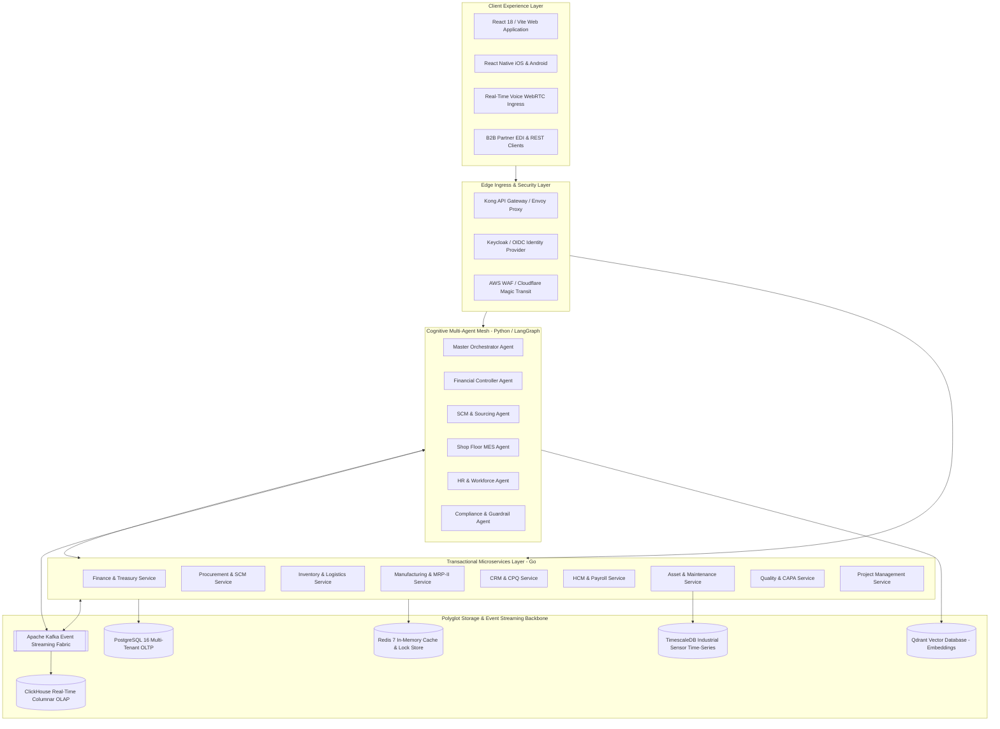
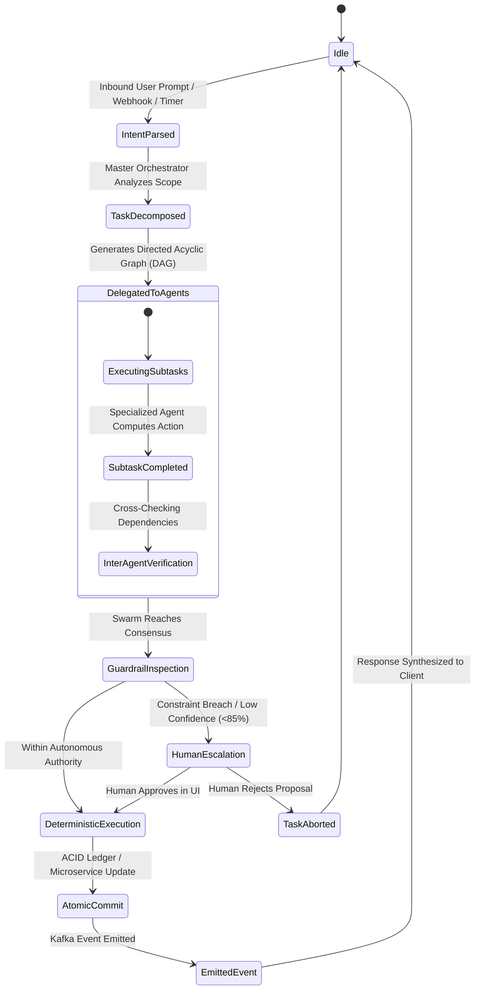

# ALGOLSOFT: Enterprise AI-Native ERP Platform
## Master Product & Functional Architecture Specification (Comprehensive Blueprint)

---

## Document Metadata & Governance
- **Document ID**: ALGOLSOFT-SPEC-ENG-2026-V4
- **Version**: 4.5.0-ENTERPRISE-PROD
- **Classification**: Production Technical Specification (Client Delivery Grade)
- **Target Audience**: Chief Technology Officers, Enterprise Solution Architects, Lead Systems Engineers, Domain Specialists
- **Scope**: Comprehensive Domain Model, Autonomous Multi-Agent Swarm, Self-Learning Feedback Topology, 12 Core Business Modules, UI/UX Design System, Security Governance, and Cross-Cutting Infrastructure

---

# TABLE OF CONTENTS

1. [Executive Architectural Vision & Paradigm Shift](#1-executive-architectural-vision--paradigm-shift)
   - 1.1 The AI-Native Enterprise Operating System
   - 1.2 Deterministic Integrity vs. Probabilistic Intelligence
   - 1.3 Target Enterprise Operating Model
2. [Domain-Driven Design (DDD) & System Topology](#2-domain-driven-design-ddd--system-topology)
   - 2.1 Bounded Context Decomposition
   - 2.2 Microservices Topology & Interaction Matrix
   - 2.3 Polyglot Persistence Architecture
3. [The Self-Learning, Self-Improving & Self-Growth Engine](#3-the-self-learning-self-improving--self-growth-engine)
   - 3.1 Foundational Architecture of the Continuous Learning Loop
   - 3.2 Reinforcement Learning from Business Feedback (RLBF)
   - 3.3 Autonomous Workflow Synthesis & Process Mining
   - 3.4 Self-Tuning Database & Automated Query Optimizer
   - 3.5 Dynamic Few-Shot Prompt Calibration & RAG Evaluation
   - 3.6 Automated Knowledge Graph Distillation
4. [Autonomous Multi-Agent Swarm Architecture](#4-autonomous-multi-agent-swarm-architecture)
   - 4.1 Swarm Orchestration & Consensus Protocol
   - 4.2 Agent Roster, Domain Competencies & Authority Boundaries
   - 4.3 Inter-Agent Communication Protocol (IACP)
   - 4.4 Guardrails, Human-in-the-Loop & Escalation Matrices
   - 4.5 Agent Memory, State Machines & Context Windows
5. [Exhaustive Functional Module Blueprints](#5-exhaustive-functional-module-blueprints)
   - 5.1 [Financial Management & Global Treasury](#51-financial-management--global-treasury)
   - 5.2 [Supply Chain, Sourcing & Procurement (SCM)](#52-supply-chain-sourcing--procurement-scm)
   - 5.3 [Intelligent Warehouse & Inventory Logistics (WMS)](#53-intelligent-warehouse--inventory-logistics-wms)
   - 5.4 [Advanced Manufacturing Execution & MRP-II (MES)](#54-advanced-manufacturing-execution--mrp-ii-mes)
   - 5.5 [Human Capital Management & Global Payroll (HCM)](#55-human-capital-management--global-payroll-hcm)
   - 5.6 [Customer Relationship Management & CPQ (CRM)](#56-customer-relationship-management--cpq-crm)
   - 5.7 [Project Portfolio Management & Professional Services (PSA)](#57-project-portfolio-management--professional-services-psa)
   - 5.8 [Enterprise Asset Management & Predictive Maintenance (EAM)](#58-enterprise-asset-management--predictive-maintenance-eam)
   - 5.9 [Quality Management System & CAPA (QMS)](#59-quality-management-system--capa-qms)
   - 5.10 [Document Intelligence & Cognitive OCR Engine](#510-document-intelligence--cognitive-ocr-engine)
   - 5.11 [Real-Time Executive Intelligence & OLAP Analytics](#511-real-time-executive-intelligence--olap-analytics)
   - 5.12 [Low-Code BPMN 2.0 Workflow Automation Engine](#512-low-code-bpmn-20-workflow-automation-engine)
6. [UI/UX Design System & Adaptive Experience Architecture](#6-uiux-design-system--adaptive-experience-architecture)
   - 6.1 Enterprise Design Tokens & Theme Philosophy
   - 6.2 Adaptive Layouts & Information Density Management
   - 6.3 Universal Command Palette & Keyboard Workflows
   - 6.4 Contextual Sidecar & Multimodal Verification
7. [Enterprise Security, Compliance & Governance Framework](#7-enterprise-security-compliance--governance-framework)
   - 7.1 Zero-Trust Architecture & Cryptographic RBAC/ABAC
   - 7.2 Multi-Jurisdiction Compliance Matrix
   - 7.3 Data Privacy, Field-Level Encryption & Right-to-be-Forgotten
   - 7.4 Cryptographic Audit Trail & Immutable Logging
8. [Cross-Cutting Technical Capabilities & Resilience](#8-cross-cutting-technical-capabilities--resilience)
   - 8.1 Saga Orchestration & Distributed Transaction State Machines
   - 8.2 High Availability, Multi-Region Active-Active & BCDR
   - 8.3 Chaos Engineering & Automated Fault Injection

---

# 1. EXECUTIVE ARCHITECTURAL VISION & PARADIGM SHIFT

## 1.1 The AI-Native Enterprise Operating System
Modern enterprise organizations operate in highly dynamic, complex global environments characterized by volatile supply chains, shifting geopolitical regulations, fluctuating currency valuations, and demanding customer expectations. Traditional Enterprise Resource Planning (ERP) systems—such as SAP S/4HANA, Oracle Fusion, NetSuite, and Microsoft Dynamics 365—were engineered in prior decades as relational transaction recording systems. 

These legacy architectures suffer from fundamental systemic limitations:
1. **Passive Nature**: They rely on human operators to manually capture, re-key, validate, and reconcile data across complex, multi-tab forms.
2. **Operational Latency**: Transactions are processed in batch intervals, with reporting, trial balances, and financial closings requiring days or weeks of manual reconciliation.
3. **Fragile Customizations**: Tailoring workflows to organizational idiosyncrasies requires expensive proprietary consulting (e.g., ABAP, SuiteScript) that creates severe technical debt and impedes cloud upgrades.
4. **Disjointed Intelligence**: Artificial Intelligence and Machine Learning features are typically "bolted on" as superficial side-panels rather than serving as the foundational operating fabric.

**ALGOLSOFT** fundamentally re-engineers enterprise management by establishing the world's first **AI-Native, Autonomous Enterprise Operating System**. Rather than acting as a static record-keeper, ALGOLSOFT functions as a proactive, predictive, and continuously learning cognitive mesh that automates complex operational decisions, predicts market shifts, enforces financial guardrails, and optimizes organizational execution in real time.

```
┌───────────────────────────────────────────────────────────────────────────────────────────────────┐
│                                   THE ALGOLSOFT COGNITIVE MESH                                    │
├───────────────────────────────────────────────────────────────────────────────────────────────────┤
│                                                                                                   │
│  [ NATURAL LANGUAGE & MULTIMODAL INGRESS ]  ◄──►  Voice, Scanned PDFs, EDI, API, Web, Mobile      │
│                         │                                                                         │
│                         ▼                                                                         │
│  [ AUTONOMOUS MULTI-AGENT SWARM ]           ◄──►  Domain Specialized Cognitive Workers            │
│                         │                                                                         │
│                         ▼                                                                         │
│  [ EVENT STREAMING NERVOUS SYSTEM ]         ◄──►  Apache Kafka KRaft Backbone (Sub-5ms Latency)   │
│                         │                                                                         │
│                         ▼                                                                         │
│  [ POLYGLOT PERSISTENCE FABRIC ]            ◄──►  PostgreSQL (OLTP) + ClickHouse (OLAP) + Qdrant  │
│                         │                                                                         │
│                         ▼                                                                         │
│  [ SELF-LEARNING & FEEDBACK ENGINE ]        ◄──►  RLBF, Continuous Indexing, Dynamic Workflows    │
│                                                                                                   │
└───────────────────────────────────────────────────────────────────────────────────────────────────┘
```

---

## 1.2 Deterministic Integrity vs. Probabilistic Intelligence
A primary architectural challenge in integrating Artificial Intelligence into enterprise ERP systems is the tension between **probabilistic machine learning models** and **deterministic financial/compliance requirements**. Large Language Models (LLMs) and neural networks are probabilistic engines that excel at reasoning, synthesis, semantic extraction, and pattern recognition, but cannot be permitted to directly mutate financial ledgers without mathematical determinism.

ALGOLSOFT resolves this through a strict **Decoupled Verification Architecture**:
- **The Cognitive Layer (Probabilistic)**: Employs foundation models, vision transformers, and multi-agent swarms to parse unstructured documents, forecast customer demand, suggest optimal warehouse pick paths, draft vendor purchase orders, and recommend journal entry classifications.
- **The Core Transaction Engine (Deterministic)**: Enforces rigid double-entry accounting invariants ($\sum \text{Debits} \equiv \sum \text{Credits}$), inventory conservation laws ($\text{Opening Stock} + \text{Receipts} - \text{Issues} \equiv \text{Closing Stock}$), multi-tenant isolation, cryptographic audit signing, and Row-Level Security.
- **The Validation Barrier**: Every action proposed by an AI agent must pass through deterministic validation gates (business rule engines, budget encumbrance checks, segregation of duties checkers) before being committed to the transactional ledger.

---

## 1.3 Target Enterprise Operating Model
ALGOLSOFT is engineered to scale seamlessly across the enterprise lifecycle:

| Dimension | Mid-Market ($10M - $100M ARR) | Large Enterprise ($100M - $1B ARR) | Global Conglomerate ($1B+ ARR) |
|---|---|---|---|
| **Deployment Topology** | Multi-tenant shared compute, isolated schema | Dedicated compute cluster, dedicated database | Multi-region active-active, hybrid on-prem edge |
| **Entities Supported** | 1 - 10 legal subsidiaries | 10 - 100 subsidiaries | 100+ global entities, multi-tier holding hierarchies |
| **Transaction Volume** | 50,000 transactions / day | 1,000,000 transactions / day | 50,000,000+ transactions / day |
| **Autonomous Rate** | 60% zero-touch transactions | 80% zero-touch transactions | 90%+ autonomous straight-through processing |
| **Data Residency** | Single sovereign cloud region | Multi-region geo-fenced schemas | Hybrid sovereign data mesh (GDPR, HIPAA, China DSL) |

---

# 2. DOMAIN-DRIVEN DESIGN (DDD) & SYSTEM TOPOLOGY

## 2.1 Bounded Context Decomposition
The platform is structured into strictly bounded contexts adhering to Domain-Driven Design (DDD) principles. Each bounded context encapsulates its own domain models, business logic, persistence schemas, and API contracts.

```
┌───────────────────────────────────────────────────────────────────────────────────────────────────┐
│                                   BOUNDED CONTEXT TOPOLOGY                                        │
├──────────────────────────┬─────────────────────────────────────────┬──────────────────────────────┤
│ CORE DOMAINS             │ SUPPORTING DOMAINS                      │ GENERIC DOMAINS              │
├──────────────────────────┼─────────────────────────────────────────┼──────────────────────────────┤
│ • Financial General Ledger│ • Human Capital Management (HCM)        │ • Identity & Access (IAM)    │
│ • SCM & Global Sourcing  │ • Customer Relationship Mgmt (CRM/CPQ)  │ • Document AI & OCR Engine   │
│ • Warehouse Logistics    │ • Project Portfolio Management (PSA)    │ • BPMN 2.0 Workflow Engine   │
│ • MRP-II Manufacturing   │ • Enterprise Asset Management (EAM)     │ • Real-time Event Streaming  │
│ • Multi-Agent Swarm      │ • Quality Management & CAPA (QMS)       │ • Audit & Cryptographic Log  │
│ • Self-Learning Engine   │ • Executive Business Intelligence (BI)  │ • Notification & Gateway     │
└──────────────────────────┴─────────────────────────────────────────┴──────────────────────────────┘
```

---

## 2.2 Microservices Topology & Interaction Matrix
The system is implemented as a suite of decoupled microservices engineered in **Go** (for performance-critical transactional and logistics workloads), **Python** (for AI orchestration, computer vision, and machine learning), and **Node.js/TypeScript** (for real-time collaboration and WebSocket streaming).



---

## 2.3 Polyglot Persistence Architecture

To optimize performance, scalability, and operational reliability, ALGOLSOFT avoids generic single-database anti-patterns:

```
┌───────────────────────────────────────────────────────────────────────────────────────────────────┐
│                                POLYGLOT PERSISTENCE SPECIFICATION                                 │
├─────────────────────┬───────────────────────────────┬─────────────────────────────────────────────┤
│ DATABASE ENGINE     │ PRIMARY WORKLOAD              │ DATA CONSTRUCTS & RETENTION                 │
├─────────────────────┼───────────────────────────────┼─────────────────────────────────────────────┤
│ **PostgreSQL 16**   │ Relational OLTP, ACID State   │ Ledger entries, invoices, purchase orders,  │
│                     │ Row-Level Security (RLS)      │ employee records, BOMs, master data.        │
├─────────────────────┼───────────────────────────────┼─────────────────────────────────────────────┤
│ **ClickHouse**      │ Columnar Real-Time Analytics  │ Financial trial balances, event telemetry,  │
│                     │ High-Throughput Aggregation   │ process mining logs, clickstream events.    │
├─────────────────────┼───────────────────────────────┼─────────────────────────────────────────────┤
│ **TimescaleDB**     │ Time-Series Telemetry & IoT   │ Machine vibration, shop floor temperatures, │
│                     │ Hypertables & Compression     │ OEE metric streams, sensor telemetry.       │
├─────────────────────┼───────────────────────────────┼─────────────────────────────────────────────┤
│ **Qdrant / Vector** │ High-Dimensional Embeddings   │ Enterprise policies, contract clauses, RAG  │
│                     │ Approximate Nearest Neighbor  │ document chunks, agent episodic memory.     │
├─────────────────────┼───────────────────────────────┼─────────────────────────────────────────────┤
│ **Redis 7 Cluster** │ Ephemeral L2 Distributed Cache│ Active user sessions, distributed mutexes,  │
│                     │ Pub/Sub & Rate Limiting       │ dynamic feature flags, live cart states.    │
├─────────────────────┼───────────────────────────────┼─────────────────────────────────────────────┤
│ **Apache Kafka**    │ High-Durability Commit Log    │ Transaction state changes, agent messages,  │
│                     │ Event Sourcing Backbone       │ audit events, integration webhooks.         │
└─────────────────────┴───────────────────────────────┴─────────────────────────────────────────────┘
```

---

# 3. THE SELF-LEARNING, SELF-IMPROVING & SELF-GROWTH ENGINE

## 3.1 Foundational Architecture of the Continuous Learning Loop
Enterprise software systems typically degrade over time: business rules become obsolete, master data drifts, and changing market dynamics cause forecasting errors. ALGOLSOFT incorporates an active, autonomous **Self-Learning & Continuous Improvement Loop (SL-CIL)** that operates on a 24/7 background cycle.

```
       ┌────────────────────────────────────────────────────────────────────────────┐
       │                       1. TELEMETRY & FEEDBACK CAPTURE                      │
       │  • Human Approvals, Edit Differentials, and Explicit Overrides             │
       │  • Downstream Financial & Operational Variances (e.g. DSO, Scrap Rates)   │
       │  • Query Latencies, Cache Misses, and Database Lock Contention             │
       └─────────────────────────────────────┬──────────────────────────────────────┘
                                             │
                                             ▼
       ┌────────────────────────────────────────────────────────────────────────────┐
       │                       2. COGNITIVE DISCREPANCY ANALYSIS                    │
       │  • Reinforcement Learning from Business Feedback (RLBF) Reward Scoring     │
       │  • Covariance Shift & Feature Drift Detection (Evidently AI / Feast)       │
       │  • Bottleneck Mining on Transactional Event Graphs                         │
       └─────────────────────────────────────┬──────────────────────────────────────┘
                                             │
                                             ▼
       ┌────────────────────────────────────────────────────────────────────────────┐
       │                       3. CONTINUOUS ADAPTATION & REFINEMENT                │
       │  • Low-Rank Adaptation (LoRA) Weight Recalibration for Domain Agents       │
       │  • Dynamic Safety Stock & Reorder Point Parameter Auto-Tuning              │
       │  • Synthetic Few-Shot Prompt Distillation & RAG Context Re-ranking         │
       └─────────────────────────────────────┬──────────────────────────────────────┘
                                             │
                                             ▼
       ┌────────────────────────────────────────────────────────────────────────────┐
       │                       4. AUTONOMOUS INFRASTRUCTURE EVOLUTION               │
       │  • Automated PostgreSQL & ClickHouse Index Synthesis & Application         │
       │  • Predictive Redis Cache Pre-Warming based on Seasonal Shift Trends       │
       │  • Low-Risk Workflow Auto-Approval Elevation                               │
       └────────────────────────────────────────────────────────────────────────────┘
```

---

## 3.2 Reinforcement Learning from Business Feedback (RLBF)
When an AI agent performs or recommends an enterprise action (such as categorizing an AP invoice line item, assigning a supplier RFQ, or scheduling a work order), the system generates an operational prediction $\hat{y}$.

1. **Explicit Human Interaction Signals**:
   - **Zero-Modification Acceptance**: The user approves the agent's proposal without altering any field (Positive Reward: $+1.0$).
   - **Field Modification**: The user alters specific fields, such as updating the GL Account from `6100` (Office Expense) to `6150` (Software Subscription) (Weighted Negative Penalty proportional to normalized Levenshtein / semantic distance: $-0.4$).
   - **Total Rejection / Workflow Reroute**: The user rejects the proposed transaction completely (Strong Negative Penalty: $-1.0$).

2. **Downstream Business Outcome Signals**:
   - For demand forecasts, the error is computed 30/60/90 days later when actual sales materialize ($\text{RMSE} = \sqrt{\frac{1}{n}\sum (y_t - \hat{y}_t)^2}$).
   - For supplier selection, the delivery timeliness and part quality are recorded upon Goods Receipt Note (GRN) inspection.

3. **Mathematical Formulation of the RLBF Reward**:
   $$\mathcal{R}_t = \lambda_1 \cdot \mathbb{I}_{\text{accept}} - \lambda_2 \cdot \mathcal{D}(\hat{y}_{\text{agent}}, y_{\text{human}}) - \lambda_3 \cdot \mathcal{L}_{\text{downstream}} - \lambda_4 \cdot \tau_{\text{exec}}$$
   Where:
   - $\mathbb{I}_{\text{accept}} \in \{0, 1\}$ indicates straight-through approval.
   - $\mathcal{D}(\cdot, \cdot)$ measures the normalized modification divergence.
   - $\mathcal{L}_{\text{downstream}}$ represents downstream financial/operational error.
   - $\tau_{\text{exec}}$ penalizes inference and execution latency.

---

## 3.3 Autonomous Workflow Synthesis & Process Mining
ALGOLSOFT embeds an in-memory process mining engine that continuously evaluates the immutable audit log (`audit_events` in ClickHouse).

```
┌───────────────────────────────────────────────────────────────────────────────────────────────────┐
│                                PROCESS MINING & WORKFLOW ELEVATION                                │
├───────────────────────────────────────────────────────────────────────────────────────────────────┤
│                                                                                                   │
│  Historical Process Trace:                                                                        │
│  [ PO Created ] ──► [ Dept Mgr Approval ] ──► [ VP Approval ] ──► [ PO Dispatched ]               │
│                                                                                                   │
│  Mining Discovery:                                                                                │
│  • Category: "Standard Cloud Infrastructure" (< $5,000 / month)                                   │
│  • Sample Size: 120 consecutive instances over 12 months                                          │
│  • Human Intervention: 100% approved with 0 edits, avg. human latency = 3.4 days                 │
│                                                                                                   │
│  Autonomous Action:                                                                               │
│  • Generates "Policy Elevation Recommendation" with statistical confidence (p < 0.0001)           │
│  • System Admin clicks "Authorize Autonomous Bypass"                                              │
│                                                                                                   │
│  Elevated Autonomous Process Trace:                                                               │
│  [ PO Created ] ──► [ AI Guardrail & Budget Verification ] ──► [ Instant Auto-PO Dispatch ]        │
│                                                                                                   │
└───────────────────────────────────────────────────────────────────────────────────────────────────┘
```

---

## 3.4 Self-Tuning Database & Automated Query Optimizer
To prevent performance degradation as tenant databases scale into billions of rows, the platform incorporates an autonomous database tuning agent:
1. **Telemetry Ingestion**: Intercepts `pg_stat_statements` and ClickHouse system query logs to identify queries with execution times exceeding the $95^{\text{th}}$ percentile threshold ($>50\text{ms}$).
2. **Synthetic Execution Plan Analysis**: Analyzes query structure, identifying sequential scans, high-cost nested loops, and missing composite indexes across multi-tenant columns (`tenant_id`, `created_at`, `status`).
3. **Sandboxed Index Validation**: Spawns an ephemeral background worker on a read replica, executes `CREATE INDEX CONCURRENTLY`, runs benchmark query workloads, and validates index hit rates and cache memory footprints.
4. **Autonomous Deployment**: Submits a non-blocking DDL migration patch during scheduled low-traffic maintenance windows, logging the action to the system governance ledger.

---

# 4. AUTONOMOUS MULTI-AGENT SWARM ARCHITECTURE

## 4.1 Swarm Orchestration & Consensus Protocol
Rather than utilizing an unconstrained conversational agent, ALGOLSOFT deploys a **Hierarchical Autonomous Swarm** organized around specialized operational domains. The swarm operates via a formal **Plan-Delegate-Verify-Commit** state machine.



---

## 4.2 Agent Roster, Domain Competencies & Authority Boundaries

```
┌───────────────────────────────────────────────────────────────────────────────────────────────────┐
│                                 ENTERPRISE AGENT ROSTER & BOUNDARIES                              │
├──────────────────────┬──────────────────────────────────────────┬─────────────────────────────────┤
│ AGENT NAME           │ DOMAIN COMPETENCIES                      │ AUTONOMOUS AUTHORITY CEILING    │
├──────────────────────┼──────────────────────────────────────────┼─────────────────────────────────┤
│ **Master**           │ • Multi-turn intent understanding        │ • Read-only data aggregation    │
│ **Orchestrator**     │ • DAG workflow decomposition             │ • Agent task dispatch           │
│                      │ • Inter-agent conflict arbitration       │ • Synthetic dashboard assembly  │
├──────────────────────┼──────────────────────────────────────────┼─────────────────────────────────┤
│ **Financial**        │ • Double-entry journal entry synthesis   │ • Auto-post matched AP invoices │
│ **Controller**       │ • 3-way matching of invoices             │   up to $10,000                 │
│                      │ • Multi-currency FX gain/loss adjustment │ • Auto-run depreciation batches │
│                      │ • Bank reconciliation matching           │ • Encumber approved PO funds    │
├──────────────────────┼──────────────────────────────────────────┼─────────────────────────────────┤
│ **SCM &**            │ • Demand forecasting & trend analysis    │ • Auto-generate POs to approved │
│ **Procurement**      │ • Dynamic safety stock recalibration     │   tier-1 suppliers for safety   │
│                      │ • Multi-vendor RFQ package generation    │   stock replenishment           │
│                      │ • Supplier delivery & quality scoring    │ • Auto-route purchase requisitions│
├──────────────────────┼──────────────────────────────────────────┼─────────────────────────────────┤
│ **Shop Floor**       │ • Finite capacity machine scheduling     │ • Dynamic work order rerouting  │
│ **MES Agent**        │ • Multi-level BOM cost rollups           │   across identical work centers │
│                      │ • Real-time OEE telemetry analysis       │ • Automated scrap logging from  │
│                      │ • Tool wear & maintenance triggering     │   PLC sensor streams            │
├──────────────────────┼──────────────────────────────────────────┼─────────────────────────────────┤
│ **HR & Talent**      │ • Shift optimization & roster generation │ • Auto-approve standard leave   │
│ **Workforce Agent**  │ • Gross-to-net payroll tax calculation   │   matching company policy       │
│                      │ • Biometric attendance punch audit       │ • Generate statutory tax filings│
│                      │ • Internal skill ontology matching       │ • Draft offer letters           │
├──────────────────────┼──────────────────────────────────────────┼─────────────────────────────────┤
│ **Compliance &**     │ • Real-time Segregation of Duties (SoD)  │ • Hard block on unauthorized    │
│ **Audit Guardrail**  │ • Fraud pattern & outlier detection      │   toxic permission combinations │
│                      │ • Regulatory compliance validation       │ • Automated security quarantine │
└──────────────────────┴──────────────────────────────────────────┴─────────────────────────────────┘
```

---

## 4.3 Inter-Agent Communication Protocol (IACP)
Inter-agent messages are transmitted using binary Protocol Buffers over gRPC for synchronous RPCs and Kafka topics (`algolsoft.agent.swarm.*`) for asynchronous distributed problem solving.

```protobuf
syntax = "proto3";

package algolsoft.agent.v1;

option go_package = "github.com/algolsoft/engine/pkg/api/agent/v1;agentv1";

enum PriorityLevel {
  PRIORITY_UNSPECIFIED = 0;
  PRIORITY_LOW = 1;
  PRIORITY_STANDARD = 2;
  PRIORITY_HIGH = 3;
  PRIORITY_CRITICAL_EMERGENCY = 4;
}

enum ExecutionMode {
  EXECUTION_MODE_UNSPECIFIED = 0;
  EXECUTION_MODE_AUTONOMOUS = 1;
  EXECUTION_MODE_HUMAN_APPROVAL_REQUIRED = 2;
  EXECUTION_MODE_DRY_RUN_SIMULATION = 3;
}

message AgentIdentifier {
  string agent_name = 1;
  string version = 2;
  string cluster_node_id = 3;
}

message SecurityContext {
  string tenant_id = 1;
  string originating_user_id = 2;
  string correlation_trace_id = 3;
  repeated string granted_scopes = 4;
  string cryptographic_signature = 5;
}

message SwarmTaskEnvelope {
  string message_id = 1;
  int64 timestamp_utc_nanos = 2;
  PriorityLevel priority = 3;
  ExecutionMode execution_mode = 4;
  AgentIdentifier sender = 5;
  AgentIdentifier target_recipient = 6;
  SecurityContext security = 7;
  
  string action_verb = 8; // e.g., "EXECUTE_3WAY_MATCH", "RECALCULATE_SAFETY_STOCK"
  bytes payload_json = 9;
  
  double confidence_score = 10;
  repeated string reasoning_trace = 11;
}
```

---

# 5. EXHAUSTIVE FUNCTIONAL MODULE BLUEPRINTS

## 5.1 Financial Management & Global Treasury

### 5.1.1 General Ledger (GL) & Real-Time Double Entry Core
The General Ledger is the immutable core of the enterprise. Every financial transaction is recorded as an immutable set of balanced journal entry lines.
- **Hierarchical Chart of Accounts (COA)**: Supports 10 tiers of parent-child account trees with user-configurable account number masks (e.g., `XXXX-YY-ZZZ-CCCC` for Account-Department-Location-CostCenter).
- **Multi-Dimensional Financial Tagging**: Every debit and credit line item captures standard and user-defined dimensions:
  `{EntityID, DepartmentID, CostCenterID, ProjectID, ProductID, CustomerID, VendorID, EmployeeID, IntercompanyPartnerID}`.
- **Continuous Real-Time Trial Balance**: Balances are maintained via ClickHouse materialized views, providing instantaneous multi-dimensional trial balance extraction without requiring end-of-day batch processing.

```
┌───────────────────────────────────────────────────────────────────────────────────────────────────┐
│                                 GENERAL LEDGER TRANSACTION ENGINE                                 │
├───────────────────────────────────────────────────────────────────────────────────────────────────┤
│                                                                                                   │
│  1. Inbound Journal Submission                                                                    │
│     ├── Originating System (AR, AP, Payroll, Fixed Assets, Manual, or AI Agent)                   │
│     └── Validates Accounting Date within an OPEN Fiscal Period (`fiscal_periods` table)           │
│                                                                                                   │
│  2. Invariant & Guardrail Verification (ACID Transaction)                                         │
│     ├── Invariant 1: Total Debits == Total Credits (Zero Imbalance Threshold: $\epsilon = 0.00$)  │
│     ├── Invariant 2: Active Account Verification (All referenced COA codes must be active)       │
│     ├── Invariant 3: Currency Validation & FX Rate Lock (Daily ECB/Bloomberg rate lookup)         │
│     └── Invariant 4: Segregation of Duties (Poster ID != Approver ID for manual journals)         │
│                                                                                                   │
│  3. Database Commit (PostgreSQL)                                                                  │
│     ├── Appends master row to `journal_entries` with status = 'POSTED'                            │
│     └── Appends line items to `journal_entry_lines`                                               │
│                                                                                                   │
│  4. Real-Time Event Emission                                                                      │
│     └── Publishes `finance.journal.posted` to Apache Kafka                                        │
│         ├── ClickHouse updates realtime balance aggregation tables                                │
│         └── Anomaly Detection Agent validates journal against historical distribution            │
│                                                                                                   │
└───────────────────────────────────────────────────────────────────────────────────────────────────┘
```

### 5.1.2 Multi-Company Consolidation & Intercompany Elimination
- **Corporate Hierarchy Topography**: Supports multi-tier holding company trees with partial equity ownership (e.g., Parent owns 80% of Subsidiary A, which owns 60% of Subsidiary B).
- **Automated Intercompany Eliminating Entries**: Automatically detects matching intercompany sales/expenses, receivables/payables, and equity investments across corporate boundaries, generating balancing elimination entries in the consolidation ledger.
- **Multi-GAAP / IFRS Dual Ledger Reporting**: Supports parallel accounting books allowing transactions to be reported simultaneously under US GAAP, IFRS, and local statutory tax books with distinct depreciation and revenue recognition schedules.

### 5.1.3 Accounts Payable (AP), Optical 3-Way Match & Treasury
- **Cognitive Document Ingestion**: Scanned PDFs and electronic invoices are ingested, normalized, and OCR-parsed via LayoutLMv3 with sub-second latency.
- **Mathematical 3-Way Match Rule Matrix**:

$$\text{Decision} = \begin{cases}
\text{AUTO\_POST} & \text{if } |\Delta_{\text{Price}}| \le \text{Tol}_{\text{Price}} \land |\Delta_{\text{Qty}}| \le \text{Tol}_{\text{Qty}} \land \text{LineMatch} = \text{True} \\
\text{ROUTED\_TO\_BUYER} & \text{if } |\Delta_{\text{Price}}| > \text{Tol}_{\text{Price}} \lor |\Delta_{\text{Qty}}| > \text{Tol}_{\text{Qty}} \\
\text{FRAUD\_ALERT} & \text{if } \text{BankDetailsModified} = \text{True} \lor \text{AnomalyScore} > 0.90
\end{cases}$$

- **Dynamic Early Payment Discount Optimizer**: Analyzes supplier discount terms ($2/10\text{ Net }30$) against the enterprise's current cost of capital ($WACC$), automatically queuing payments to capture risk-free returns ($36.7\%$ annualized yield on $2/10\text{ Net }30$).

---

## 5.2 Supply Chain, Sourcing & Procurement (SCM)

### 5.2.1 Strategic Sourcing, RFQ & Vendor Scoring
- **Automated RFQ Package Generation**: Converts engineering specifications and purchase requisitions into multi-vendor RFQ bidding portals.
- **Supplier Composite Vector Scoring**:
  $$\text{Composite Score}_s = w_c \cdot S_{\text{Cost}} + w_q \cdot S_{\text{Quality}} + w_d \cdot S_{\text{Delivery}} + w_e \cdot S_{\text{ESG}}$$
  Where quality is derived from historical PPM (Parts Per Million) defect rates and delivery is computed from historical OTIF (On-Time In-Full) percentages.
- **Vendor Contract Volume Tier Tracking**: Continuously monitors cumulative enterprise spend against contract tiers, automatically applying negotiated volume discount rebates as spending milestones are achieved.

### 5.2.2 Purchase Order Lifecycle & ASN Ingestion
- **Automated Budget Encumbrance**: Before purchase orders are transmitted to suppliers, the procurement service locks budget allocations in the General Ledger, preventing over-budget commitments.
- **Advanced Shipping Notice (ASN) & EDI 856 Integration**: Direct ingestion of carrier tracking numbers, container vessel IDs, and itemized serial numbers, updating expected dock arrival times in the MRP engine.

---

## 5.3 Intelligent Warehouse & Inventory Logistics (WMS)

### 5.3.1 Spatial Topology & Barcode Architecture
- **Volumetric Warehouse Modeling**: Configures sites into hierarchical zones, aisles, racks, shelves, and bin coordinate matrices with weight and volume capacity constraints.
- **Universal Barcoding & RFID Support**: GS1-128, SSCC-18, DataMatrix 2D, and EPC Gen2 RFID tracking across all inventory movements.
- **Multi-Valuation Method Support**: Standard Cost, Moving Average Cost (AVCO), FIFO, and LIFO with automated inventory revaluation journals upon receipt adjustments.

### 5.3.2 Autonomous Inventory Replenishment Engine
Replaces static reorder points with a dynamic statistical model that adapts to supply chain volatility:

$$\text{Reorder Point (ROP)} = \bar{D} \times \bar{L} + Z_{\alpha} \sqrt{\bar{L} \cdot \sigma_D^2 + \bar{D}^2 \cdot \sigma_L^2}$$

```
┌───────────────────────────────────────────────────────────────────────────────────────────────────┐
│                                 DYNAMIC ROP CALCULATION EXAMPLE                                   │
├───────────────────────────────────────────────────────────────────────────────────────────────────┤
│                                                                                                   │
│  Parameters:                                                                                      │
│  • Average Daily Demand ($\bar{D}$) = 150 units                                                    │
│  • Demand Standard Deviation ($\sigma_D$) = 30 units                                              │
│  • Average Supplier Lead Time ($\bar{L}$) = 14 days                                               │
│  • Lead Time Standard Deviation ($\sigma_L$) = 3 days                                             │
│  • Target Service Level = 99.0% ($Z_{\alpha} = 2.326$)                                            │
│                                                                                                   │
│  Computation:                                                                                     │
│  1. Expected Lead Time Demand = $150 \times 14 = 2,100\text{ units}$                              │
│  2. Combined Variance = $\sqrt{14 \times (30^2) + (150^2) \times (3^2)} = \sqrt{12,600 + 202,500}$│
│                       = $\sqrt{215,100} \approx 463.788\text{ units}$                              │
│  3. Safety Stock = $2.326 \times 463.788 \approx 1,079\text{ units}$                              │
│  4. Dynamic Reorder Point (ROP) = $2,100 + 1,079 = \mathbf{3,179\text{ units}}$                   │
│                                                                                                   │
└───────────────────────────────────────────────────────────────────────────────────────────────────┘
```

### 5.3.3 Traveling Salesperson Wave Picking Optimization
- **Pick-Path Route Synthesis**: Employs genetic algorithms and Dijkstra shortest-path algorithms to calculate the optimal 3D transit path through warehouse aisles, grouping picking orders into optimized multi-order picking waves to reduce operator transit times by up to $35\%$.
- **ABC Inventory Classification & Dynamic Reslotting**: Periodically analyzes picking frequency in ClickHouse, recommending relocation of fast-moving SKU bins to floor-level positions nearest the packing docks.

---

## 5.4 Advanced Manufacturing Execution & MRP-II (MES)

### 5.4.1 Multi-Level BOMs & Engineering Change Orders (ECO)
- **Recursive Bill of Materials Graph**: Supports multi-tier engineering trees with sub-assemblies, phantom assemblies, co-products, and variable scrap coefficients.
- **Engineering Change Order (ECO) Governance**: Enforces strict revision management with automated phase-in / phase-out date gating, preventing manufacturing from consuming obsolete component revisions.

### 5.4.2 Finite Capacity Scheduling & Dispatch Engine
The manufacturing scheduling engine resolves production bottlenecks by matching work orders against real-time machine and labor constraints:

```mermaid
gantt
    title Finite Capacity Shop Floor Schedule - Work Center Alpha
    dateFormat  HH:mm
    axisFormat %H:%M

    section CNC Mill 01
    Setup WO-5011 (Part A)      :active, 08:00, 08:30
    Run WO-5011 (100 units)      :crit, 08:30, 11:30
    Preventive Maintenance Block :milestone, 11:30, 12:00
    Setup WO-5012 (Part B)      :08:00, 08:45
    Run WO-5012 (250 units)      :12:00, 15:30

    section Lathe Station 02
    Setup WO-5013 (Shaft X)     :08:00, 09:00
    Run WO-5013 (500 units)      :09:00, 14:00
```



### 5.4.3 Real-Time Overall Equipment Effectiveness (OEE)
IoT telemetry captured from industrial PLCs (via MQTT / OPC-UA) into TimescaleDB continuously computes the standard three OEE pillars:

$$\text{OEE} = \text{Availability} \times \text{Performance} \times \text{Quality}$$
- **Availability**: $\frac{\text{Operating Time}}{\text{Planned Production Time}}$
- **Performance**: $\frac{\text{Total Output} \times \text{Ideal Cycle Time}}{\text{Operating Time}}$
- **Quality**: $\frac{\text{Good Units Produced}}{\text{Total Units Produced}}$

---

## 5.5 Human Capital Management & Global Payroll (HCM)

### 5.5.1 Organizational Structure & Core HR Fabric
- **Position & Matrix Management**: Dynamic organizational hierarchy modeling with support for dotted-line reporting, job families, salary bands, and grade levels.
- **Onboarding & Offboarding Lifecycle State Machines**: Automated identity provisioning, security group assignment, asset checkouts, and exit interviews with legal document signing.

### 5.5.2 Multi-Country Gross-to-Net Payroll Computation
- **Statutory Taxation Plugins**: Pluggable micro-engines for localized payroll calculations (US W-2/1099/State Withholdings, UK PAYE/NIC, India TDS/EPF/ESI, Germany Lohnsteuer/Sozialversicherung).
- **Direct Clearing Disbursements**: Generates standard banking disbursement batches (NACHA, SEPA ISO 20022 `pain.001.001.03`, BACS) with SHA-256 integrity validation.

```
┌───────────────────────────────────────────────────────────────────────────────────────────────────┐
│                                 GROSS-TO-NET COMPUTATION MATRIX                                   │
├───────────────────────────────────────────────────────────────────────────────────────────────────┤
│                                                                                                   │
│   [Base Earnings + Overtime Hours + Incentive Bonuses]                                            │
│                          │                                                                        │
│                          ▼                                                                        │
│   LESS: Pre-Tax Deductions (401k/Retirement, Section 125 Medical, HSA)                            │
│                          │                                                                        │
│                          ▼                                                                        │
│   EQUALS: Taxable Wage Base                                                                       │
│                          │                                                                        │
│                          ▼                                                                        │
│   LESS: Statutory Withholdings (Federal, State/Provincial, Municipal, Social Security, Medicare) │
│                          │                                                                        │
│                          ▼                                                                        │
│   LESS: Post-Tax Deductions (Roth Contributions, Garnishments, Union Dues)                       │
│                          │                                                                        │
│                          ▼                                                                        │
│   EQUALS: Net Take-Home Pay (Disbursed via SEPA / NACHA Batch)                                    │
│                                                                                                   │
└───────────────────────────────────────────────────────────────────────────────────────────────────┘
```

---

## 5.6 Customer Relationship Management & CPQ (CRM)

### 5.6.1 Lead Ingestion, Deduplication & Predictive Scoring
- **Omnichannel Pipeline**: Unified ingestion from web forms, incoming emails, telephone systems, and partner APIs.
- **Machine Learning Lead Scoring**: Predicts conversion probabilities using historical firmographic data, stakeholder seniority, communication cadence, and engagement telemetry.

### 5.6.2 Configure, Price, Quote (CPQ) & Margin Protection
- **Rule-Based Product Configurator**: Validates technical component compatibility in real time during the sales quotation process.
- **Dynamic Real-Time Cost-Plus Margin Guard**: Connects directly to the live BOM and manufacturing cost model in the ERP database, ensuring sales reps cannot quote discounts that breach target contribution margins without automated manager approval.

---

## 5.7 Project Portfolio Management & Professional Services (PSA)

### 5.7.1 Critical Path Method (CPM) & Resource Leveling
- **Work Breakdown Structure (WBS)**: Hierarchical project task trees with milestone tracking, baseline comparisons, and dependency networks (FS, SS, FF, SF).
- **Automated Resource Leveling**: Identifies over-allocated personnel across concurrent client projects and calculates optimal resource reallocations based on skill ontologies.

### 5.7.2 Project Accounting & Revenue Recognition (ASC 606 / IFRS 15)
- **Billing Methods**: Time & Materials (T&M), Fixed Price Milestones, Percentage of Completion (PoC), and Retainer models.
- **Automated Revenue Recognition**: Calculates recognized vs. deferred revenue based on milestone deliverables and incurred cost ratios, posting balancing journal entries automatically.

---

## 5.8 Enterprise Asset Management & Predictive Maintenance (EAM)

### 5.8.1 Asset Registry & Depreciation Engine
- **Fixed Asset Register**: Tracks acquisition costs, physical locations, custodianship, insurance policies, and capitalization status.
- **Dual-Book Depreciation Schedules**: Computes Straight-Line, Double Declining Balance, and Units of Production schedules simultaneously for GAAP/IFRS books and local tax books.

### 5.8.2 IoT Predictive Maintenance & Anomaly Detection
- **Continuous Sensor Ingestion**: Captures high-frequency vibration, temperature, and acoustic telemetry into TimescaleDB hypertables.
- **Automated Work Order Dispatch**: When sensor metrics exceed statistical anomaly thresholds ($3\sigma$ deviation over baseline), the system automatically creates a high-priority maintenance work order, reserves replacement parts in WMS, and schedules a technician.

---

## 5.9 Quality Management System & CAPA (QMS)

### 5.9.1 Statistical Inspection Plans (AQL / ISO 2859)
- **Dynamic Sampling Tables**: Automatically determines sample inspection lot sizes based on vendor quality history and ISO 2859 Acceptable Quality Limit (AQL) standards.
- **Inspection Data Capture**: Direct digital entry of continuous dimensional measurements, visual pass/fail checks, and lab spectrometer readings.

### 5.9.2 Non-Conformance Reports (NCR) & 8D CAPA Workflows
- **Instant Lot Quarantine**: NCR generation instantly updates WMS inventory status to `QUARANTINED`, blocking picking, packing, transfer, or invoicing across all warehouses.
- **Structured 8D Problem Solving**: Enforces systematic root cause investigation (5 Whys, Ishikawa Fishbone diagrams, permanent corrective action plans, and recurrence prevention controls).

---

## 5.10 Document Intelligence & Cognitive OCR Engine

### 5.10.1 Multimodal LayoutLMv3 & Vision Transformer Pipeline
- **Template-Free Extraction**: Neural extraction of key-value pairs, nested tables, line items, and tax summaries from unstructured and semi-structured documents.
- **Confidence Scoring & Active Learning**: Extractions with confidence scores above $95\%$ are auto-committed; low-confidence fields are routed to human verification screens, with corrections feeding back into the RLBF dataset.

---

## 5.11 Real-Time Executive Intelligence & OLAP Analytics

### 5.11.1 Sub-Millisecond Columnar Data Ingestion (ClickHouse)
- **Real-Time Event Ingestion**: Kafka topics stream transactional events directly into ClickHouse MergeTree tables without batch ETL delays.
- **Materialized Aggregation Views**: Pre-computes multi-dimensional rollups across time, entity, department, and product categories for sub-10ms dashboard loads across billions of historical records.

### 5.11.2 What-If Liquidity & Scenario Simulators
- **Dynamic Cash Flow Forecasting**: Simulates enterprise liquidity across 30/60/90/180-day horizons under varying macro scenarios (e.g., $+10\%$ supply cost inflation, $-15\%$ customer payment velocity).
- **Conversational Executive Analytics**: Natural language query interface allowing executives to generate real-time financial and operational reports on demand.

---

## 5.12 Low-Code BPMN 2.0 Workflow Automation Engine

### 5.12.1 Visual Workflow Designer & Execution Runtime
- **BPMN 2.0 Compliance**: Supports complex state machine modeling including Service Tasks, User Tasks, Parallel Gateways, Event Sub-Processes, and Timer Boundary Events.
- **Dynamic Expression Evaluation**: Evaluates execution rules using a sandboxed, high-performance expression language supporting mathematical, temporal, and semantic criteria.
- **Fault-Tolerant State Persistence**: Workflow state transitions are persisted with optimistic locking, enabling transparent recovery across cluster node restarts.

---

# 6. UI/UX DESIGN SYSTEM & ADAPTIVE EXPERIENCE ARCHITECTURE

## 6.1 Enterprise Design Tokens & Theme Philosophy
ALGOLSOFT utilizes an enterprise design language optimized for visual clarity, high information density, and minimal cognitive fatigue during extended operational shifts.

```css
:root {
  /* Color Palette - Enterprise Dark Default */
  --bg-canvas: #090D16;
  --bg-surface: #111827;
  --bg-surface-elevated: #1F2937;
  --border-subtle: #374151;
  --border-focus: #3B82F6;

  /* Typography */
  --font-sans: 'Inter', -apple-system, BlinkMacSystemFont, 'Segoe UI', Roboto, sans-serif;
  --font-mono: 'JetBrains Mono', 'Fira Code', monospace;

  /* Primary Brand & Accents */
  --primary-500: #2563EB;
  --primary-600: #1D4ED8;
  --accent-cyan: #06B6D4;

  /* Semantic Status Indicators */
  --status-success: #10B981;
  --status-warning: #F59E0B;
  --status-danger: #EF4444;
  --status-info: #3B82F6;

  /* Information Density Modes */
  --cell-padding-dense: 4px 8px;
  --cell-padding-comfortable: 12px 16px;
}
```

---

## 6.2 Universal Command Palette ($Cmd+K$ / $Ctrl+K$)
Power users can execute any enterprise workflow directly from the keyboard:
- `"Create PO for Supplier Acme Steel for 500 units of Part A-100"`
- `"Show me trial balance for European subsidiary in EUR for Q2"`
- `"Quarantine inventory lot LOT-2026-0811 due to dimensional variance"`
- `"Simulate cash flow if DSO increases by 10 days"`

---

# 7. ENTERPRISE SECURITY, COMPLIANCE & GOVERNANCE FRAMEWORK

## 7.1 Zero-Trust Architecture & Cryptographic Access Control
- **Unified Identity Federation**: Native integration with enterprise identity providers via OIDC, SAML 2.0, and OAuth 2.0 (Azure AD / Entra ID, Okta, PingFederate, Google Workspace).
- **Fine-Grained RBAC & ABAC Policy Engine**: Access is evaluated using both static roles and dynamic environmental attributes (e.g., IP reputation, device risk, time of day).
- **Segregation of Duties (SoD) Engine**: Enforces cryptographic separation of conflicting operational capabilities to prevent unauthorized transactions.

---

## 7.2 Regulatory Compliance Matrix

| Regulatory Standard | Architecture Implementation in ALGOLSOFT |
|---|---|
| **SOX Section 404** | Immutable audit logs; automated approval matrices; change tracking on financial master data. |
| **GDPR / CCPA** | Automated DSAR workflows; field-level encryption for PII; automated right-to-be-forgotten routines. |
| **SOC 2 Type II** | Continuous compliance telemetry with automated evidence collection across access logs and CI/CD. |
| **ISO 27001** | ISMS enforcement, mTLS between microservices, automated key rotation via HashiCorp Vault. |
| **21 CFR Part 11** | FDA-compliant electronic signatures with mandatory reason-for-signing and tamper-proof audit trails. |

---

# 8. CROSS-CUTTING TECHNICAL CAPABILITIES & RESILIENCE

## 8.1 Saga Orchestration & Distributed Transaction State Machines
Distributed transactions spanning multiple bounded contexts are managed via orchestrated Sagas with deterministic compensating actions to guarantee eventual consistency across all services.

```
       [Order Placed Event]
                │
                ▼
      ┌────────────────────┐
      │  Saga Coordinator  │
      └─────────┬──────────┘
                │
    1. Reserve Inventory (WMS)
       ├── SUCCESS ──► 2. Authorize Payment (Finance)
       │                  ├── SUCCESS ──► 3. Commit Order (Sales)
       │                  └── FAILURE ──► Compensate: Release Inventory (WMS)
       │
       └── FAILURE ──► Abort Order & Notify Client
```

---

## 8.2 High Availability & Disaster Recovery (BCDR)
- **Zero Data Loss ($RPO = 0$)**: Achieved via synchronous multi-AZ replication across PostgreSQL and Kafka clusters.
- **Rapid Recovery ($RTO \le 15\text{ minutes}$)**: Automated failover across secondary cloud regions managed via ArgoCD GitOps synchronizations.
- **Continuous Chaos Testing**: Background execution of LitmusChaos experiments to validate fault tolerance against unexpected infrastructure failures.
